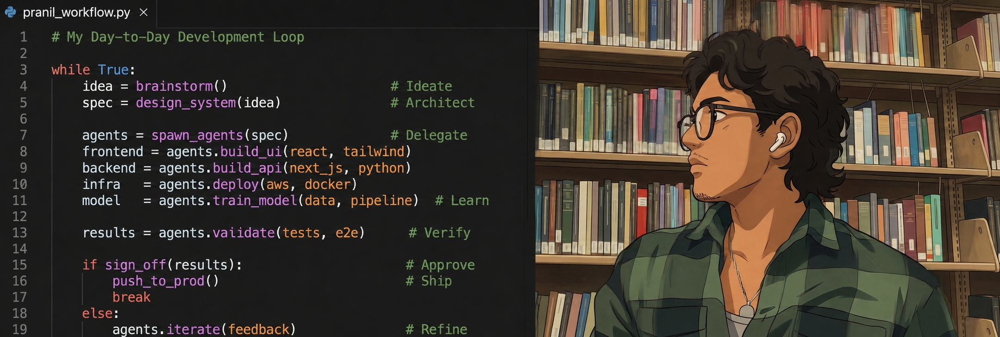
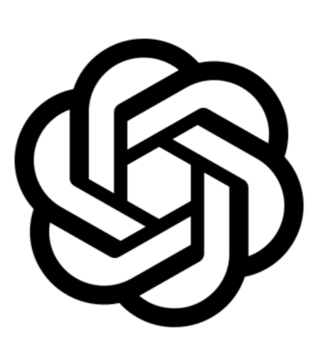

  

---

<h2>Skills</h2>

<h3>Programming Languages</h3>

  
  
  
  
  
  

<h3>Backend / Frontend / Frameworks</h3>

  
  <picture><source media="(prefers-color-scheme: dark)" srcset="https://cdn.simpleicons.org/nextdotjs/white"></picture>
  
  <picture><source media="(prefers-color-scheme: dark)" srcset="https://cdn.simpleicons.org/express/white"></picture>
  
  <picture><source media="(prefers-color-scheme: dark)" srcset="https://cdn.simpleicons.org/flask/white"></picture>
  
  
  

<h3>Cloud / DevOps / Infrastructure</h3>

  
  
  
  
  
  
  <picture><source media="(prefers-color-scheme: dark)" srcset="https://cdn.simpleicons.org/vercel/white"></picture>
  
  

<h3>Design</h3>

  
  

<h3>Databases / APIs</h3>

  
  
  
  <picture><source media="(prefers-color-scheme: dark)" srcset="https://cdn.simpleicons.org/prisma/white"></picture>

<h3>AI / ML / Data Science</h3>

  
  
  
  
  
  
  
  
  
  

<h3>Robotics / Hardware</h3>

  
  

<h3>Tooling / Development Environment</h3>

  
  
  <picture><source media="(prefers-color-scheme: dark)" srcset="https://cdn.simpleicons.org/github/white"></picture>
  

<h3>Operating Systems</h3>

  
  
  

---

<h2>GitHub Activity</h2>

  

  

